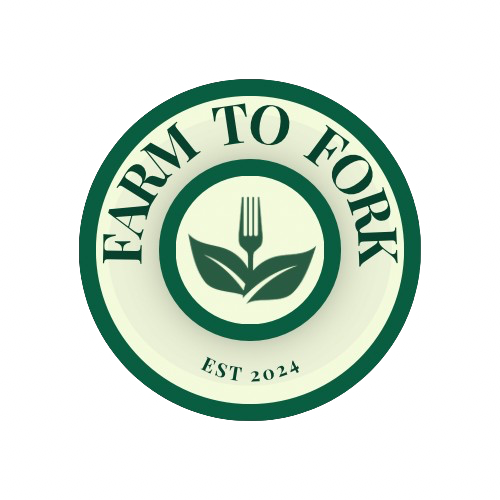

# Farm to Fork
<p>Feeding mouths, est 2024. Based in the West Midlands</p>
<p>Team 45</p>

## How to use
- If you would like to view and use this website on our server go to [here](http://cs2team45.cs2410-web01pvm.aston.ac.uk/)

- To run this locally you must have:
- [Node.js](https://nodejs.org/) - Used for running JavaScript on the server and managing frontend dependencies.
- [PHP](https://www.php.net/) - Used for the backend of the application.
- [Composer](https://getcomposer.org/) - Dependency manager for PHP, used to install and manage libraries.
- Choose between [PostgreSQL](https://www.postgresql.org/) or [MySQL](https://www.mysql.com/) - Used for the database management system.
  
	### Steps

1. Clone the repository:

    ```bash
    git clone https://github.com/rederick29/team-project
    cd team-project
    ```

2. Install dependencies:

    ```bash
    npm install
    composer install
    ```

3. Set up environment file and generate `APP_KEY`:

    ```bash
    cp .env.example .env
    php artisan key:generate
    ```

4. Build assets and start the application:

    ```bash
    # Open the first terminal and type:
    npm run dev    # Runs the debug server for the website

    # Open the second terminal and type:
    php artisan migrate
    php artisan db:seed
    php artisan storage:link
    php artisan serve
    ```

## Features
- [LIVE] 2025 Egg Hunt - 10% discount!
- Review the website - let us know what you think!
- Google embed of Farms To Fork Ltd, West Midlands, UK
- About us - Learn about our morals and commitment to sustainable food systems
- Browse our selection of fresh ingredients packed into boxes!
- Filter and find your preference and perfect box within a selected price range and category!
- Grab and learn about your favourite box with their average rating, stock amount, tags, nutritional information, an array of product images and a magnifying glass!
- Give individual boxes a review - give insight and your thoughts to other customers!
- With our all new recipe section, cook up a healthy meal in no time!
- Filter through recipes depending on their tags.
- Recipes are displayed in a visually-pleasing manner, showing their time to cook, servings amount and average rating.
- Each recipe includes their description, required ingredients and preparation steps as well as a magnifying glass to stare at these delicious recipes.
- Got a query? Contact us! Any detail about our product or site is valuable to us!
- Customers can manage personal information, orders, addresses, rewards, payments and contact preferences in the user dashboard!
- The user dashboard includes personal information than can be updated, tracking the status of orders as well as returning boxes, addresses can be added, edited and removed for checkout ease of access, stamp your card daily to get a reward and check promo codes in the rewards section, payments can be added, edited and removed and contact preferences can be set.
- Before checking out, users can modify their shopping habits in the cart section.
- Checkout includes adding your address with ease because of the saved address feature as well as any saved payment method, a display of what the user is buying (quantity and price) as well as a promo code input to help discount on items.
- When checking out, users are redirected to a thank you page - because we value YOU!
- Admin dashboard includes user detail manage, order processing list, inventory management, adding new products, customers, statistical reports and enquiries
- Admins can search and filter through users, check their personal order history and expand info which will display all personal details and addresses
- Moreover, administrators can filter and search orders as well as process them which will advance orders to their next status stage
- In the inventory management section, every item is displayed with their image, title, description, price, tags, type and stock. A low and out of stock indicator is displayed at the top of the screen if stocks are ever short!
- For ease of use, administrators can increase the stock with a click of a button as well as edit an on-shelf product, changing their image, title, price, tags, type, stock, description or even deleting it!
- Adding new products couldn't have been easier - admins can upload and image and get a product on shelf through the dashboard!
- Every customer will be displayed on the admin dashboard, admins can filter through administrators and users and change their roles
- The reports dashboard help administrators monitor the site and see any outgoing values that will aid in creating a better experience for the customer. This includes the total of users, orders, average order value, returned orders, return rate, total revenue, total inventory value and items, total enquiries, total product reviews and average rating as well as the total site reviews and average site rating. A pie chart is produced, displaying the variety of products from Farm to Forks
- Enquiries is a newly added feature. Administrators can filter through seen/unseen enquiries from the contact us form. Each enquiry displays their name, email, phone number, query and date. Admins can mark an enquiry as seen

## Pages available
Pages include but aren't limited to -
- Home
- Site review
- About us
- Boxes
- Individual boxes
- Boxes review
- Recipes
- Individual recipes
- Contact us
- Cart
- Checkout
- Checkout confirmation
- Account -
- Personal information
- Orders
- Addresses
- Rewards
- Payments
- Contact Preferences
- Admin dashboard -
- User detail management
- Order Processing List
- Inventory Management
- Add New Product
- Customers
- Individual customers
- Reports
- Enquiry
- Any editable form will include a new page

## Meet the team
- Peace
- Aarif
- Hafsa
- Salim
- Hamza
- Naomi
- Krishna
- Aisha

:) :3
